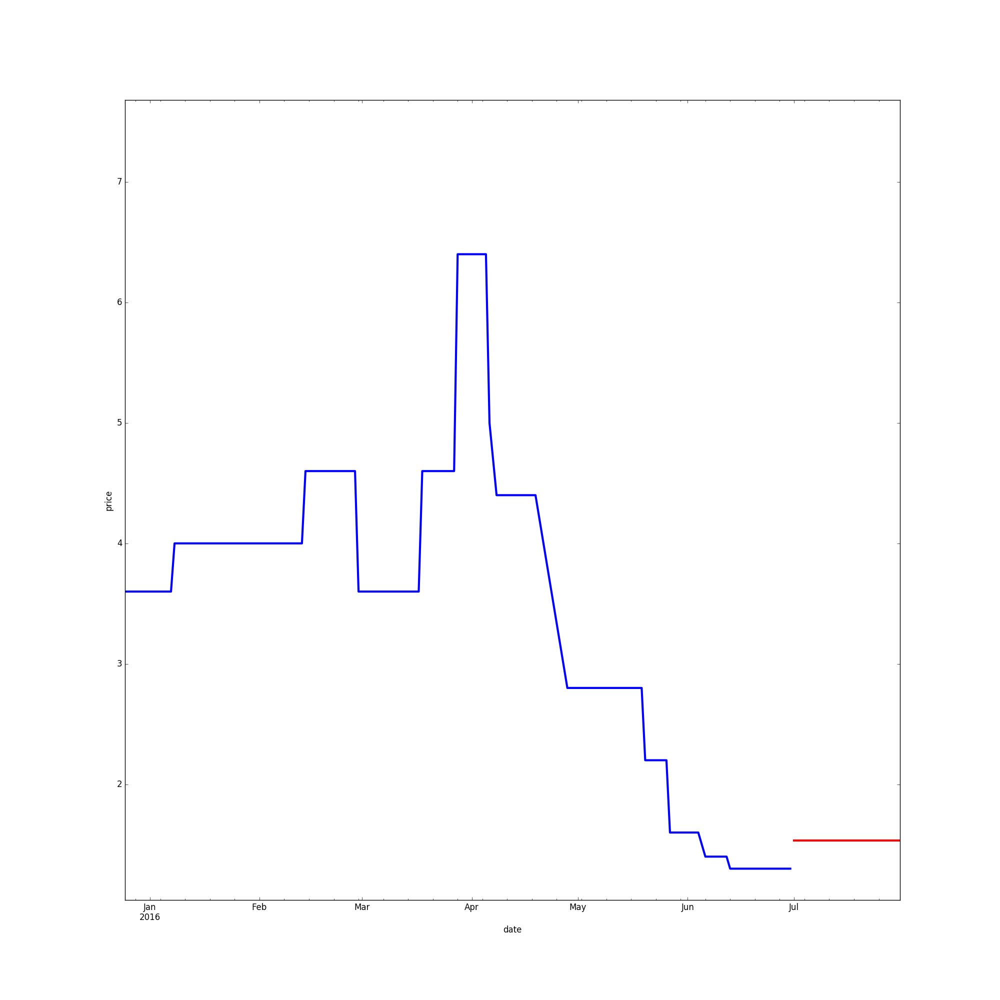

### ccf 农产品价格预测分析

---
参加[2016 ccf FutureData大数据大赛：农产品价格预测分析](http://www.wid.org.cn/data/science/player/competition/detail/description/244)

最终成绩：35/100（复赛）

---

---

#### 项目文件组成

```
.
├── data
│   ├── farming.csv(复赛训练数据)
│   └── product_market.csv(复赛预测数据)
├── forecast
│   ├── GBDT.py
│   ├── __init__.py
│   └── Naive.py
├── Preprocess
│   ├── FeaturePreprocessor.py
│   ├── FilePreprocessor.py
│   ├── ImputationPreprocessor.py
│   ├── __init__.py
│   ├── PlotPreprocessor.py
│   └── Utils.py
```
---
 
#### 运行方法

1. 在 `Preprocess/Utils.py` 填入`base`文件夹
2. 运行 `FilePreprocessor.py` 将文件进行分割
3. 运行 `ImputationPreprocessor.py` 进行缺失值填补
4. 运行 `FeaturePreprocessor.py` 提取特征
5. （可选）调节`forecast/GBDT.py`的参数设置
6. 运行 `forecast/GBDT.py` 使用`GBDT`模型进行预测
7. 运行 `PlotPreprocessor.py` 查看历史价格走势（蓝线）和预测价格（红线）
如下：

